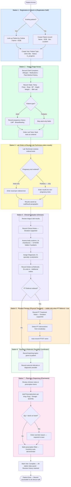

# Patient Flow

```mermaid
flowchart TD
    A([Patient Arrives]) --> B

    subgraph REG["Station 1 · Registration & Check-In (Registration Staff)"]
        B{Existing patient?}
        B -->|Yes| C[Look up Patient by Cedula / Name + DOB]
        B -->|No| D[Create Patient record: Name · DOB · Sex · Location]
        C --> E[Create Visit: Patient Type · Clinic Site · Status: in_progress]
        D --> E
    end

    E --> F

    subgraph TRIAGE["Station 2 · Triage (Triage Nurse)"]
        F[Record Chief Complaint · Allergies · Medications · Past Medical History]
        F --> G[Record Vitals: Temp · Pulse · Resp · BP · Height · Weight → BMI calc]
        G --> H{Patient type?}
        H -->|Adult| I[Record pregnancy history · LMP · Breastfeeding]
        H -->|Pediatric| J[Skip adult-only fields]
        I --> K[Order Lab Tests: Mark tests as ordered]
        J --> K
    end

    K --> L

    subgraph LAB["Station 3 · Lab Orders & Results (Lab Technician enters results)"]
        L[Lab Technician reviews ordered tests]
        L --> M{Pregnancy test ordered?}
        M -->|Adult only| N[Enter result per ordered test]
        M -->|Pediatric — skip| O[Enter results for non-pregnancy tests]
        N --> P[Results saved as LabResult paragraphs]
        O --> P
    end

    P --> Q

    subgraph CLINICAL["Station 4 · Clinical Evaluation (Clinician)"]
        Q[Review triage & lab results]
        Q --> R[Record Clinical Notes — Dictation supported]
        R --> S[Assess body systems: 14 checkboxes — GYN/OB hidden if pediatric]
        S --> T[Assign Diagnoses: 21 specialty vocabularies]
        T --> U[Record Orders & Referrals: Dx write-in · Additional orders]
        U --> V{PT Referral ordered?}
    end

    V -->|Yes| W
    V -->|No| TEACH1

    subgraph PT["Station 5 · Physical Therapy (Physical Therapist) — visible only when PT Referral = true"]
        W[Record PT Treatment Notes — Dictation supported]
        W --> W2[Select PT Interventions from vocabulary]
        W2 --> W3[Auto-record PT/OT name]
    end

    W3 --> TEACH1

    subgraph TEACH["Station 6 · Teaching & Referrals (Teaching Coordinator)"]
        TEACH1[Record teaching topics given to patient]
        TEACH1 --> TEACH2[Record external referrals or diagnostic provider]
    end

    TEACH2 --> X

    subgraph PHARMACY["Station 7 · Pharmacy Dispensing (Pharmacist)"]
        X[Review clinician notes & prescription items]
        X --> X2[Add PrescriptionItem per drug: Drug · Dosage · Quantity]
        X2 --> X3{Qty > stock on hand?}
        X3 -->|Yes| X4[Enter override reason — required to save]
        X3 -->|No| X5[Mark prescription filled — Inventory auto-decremented]
        X4 --> X5
    end

    X5 --> DONE[Mark Visit: Complete — All station data saved · Revision history retained]
    DONE --> END([Patient Exits — Record accessible to all clinical staff])

    style REG fill:#dbeafe,stroke:#3b82f6,color:#000000
    style TRIAGE fill:#dcfce7,stroke:#22c55e,color:#000000
    style LAB fill:#fef9c3,stroke:#eab308,color:#000000
    style CLINICAL fill:#ede9fe,stroke:#8b5cf6,color:#000000
    style PT fill:#ffedd5,stroke:#f97316,color:#000000
    style PHARMACY fill:#fce7f3,stroke:#ec4899,color:#000000
    style TEACH fill:#f0fdf4,stroke:#16a34a,color:#000000
```
