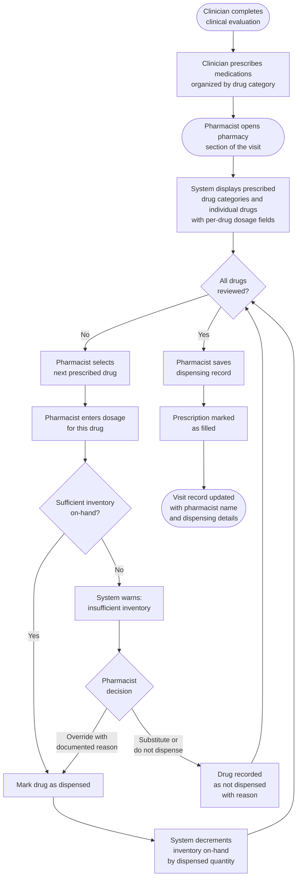
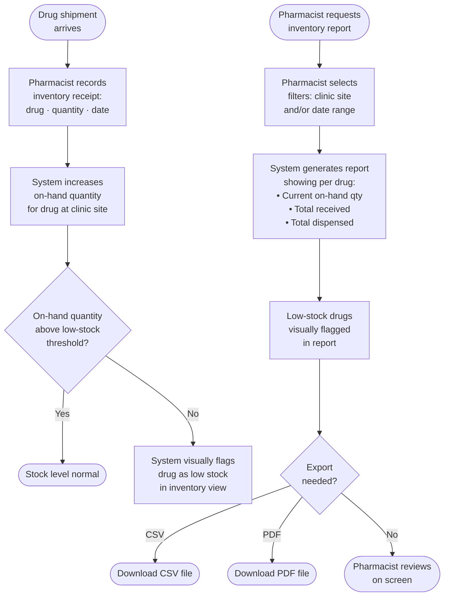
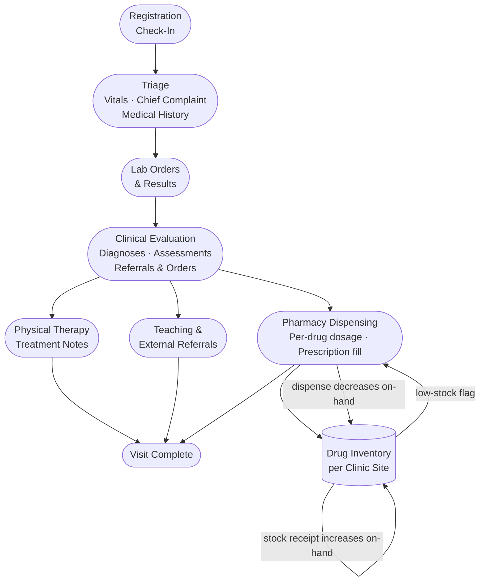

# Pharmacy Workflow Diagrams

## 1. Pharmacy Dispensing Workflow

This diagram covers the end-to-end flow from clinical prescription through drug dispensing and inventory deduction.

---

## 2. Pharmacy Inventory Management Workflow

This diagram covers stock intake, low-stock monitoring, and inventory reporting — independent of patient visits.

---

## 3. Full Pharmacy Context: Position in the Clinic Visit Workflow

This diagram shows where the pharmacy station sits within the broader clinic visit workflow, and how it connects to the inventory system.

---

## Actors

| Actor | Pharmacy Role |
|-------|--------------|
| Clinician | Prescribes medications by drug category during clinical evaluation |
| Pharmacist | Reviews prescriptions, enters per-drug dosage, dispenses drugs, manages inventory, generates reports |
| System | Tracks on-hand inventory, warns on insufficient stock, decrements inventory on dispensing, flags low stock |

## Key Rules

- Each prescribed drug has its own individual dosage field (not a shared dosage field).
- Drugs are organized into collapsible category groups: anti-infective agents, GI agents, cardiac agents, dermatologic agents, respiratory agents, pain management, vitamins/nutrients, ophthalmic/otic, miscellaneous, chronic disease medications.
- Inventory is tracked per drug per clinic site, not globally.
- Dispensing a drug always decrements inventory; an override with documented reason is required to dispense when stock is insufficient.
- Inventory receipts (stock additions) and dispensing events are recorded separately, allowing cumulative totals in reports.
- Reports are filterable by clinic site and date range, and exportable to CSV or PDF.
